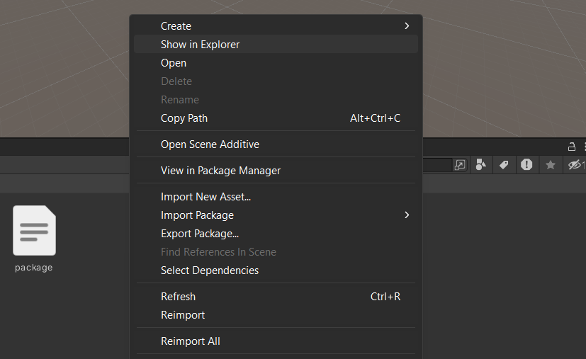

# Make Unity Darker in Windows

> make unity's top menu bar and context menu dark

It will automatically sync to the theme in Unity Preferences.

## Getting Started

just go to package manager and install this package

## Screenshots

